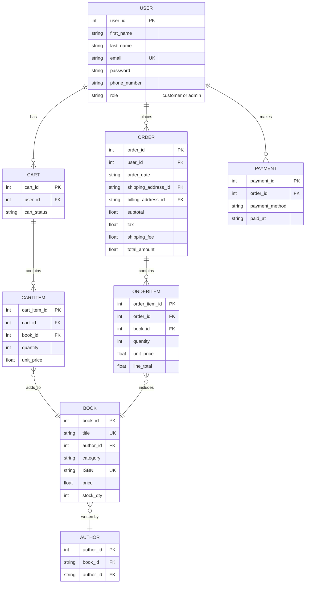

# Pacific Times Book Market - Database Schema

## Entity Relationship Diagram

## Tables Overview

### USER
- **user_id** (PK): Unique identifier
- **first_name**: Customer/admin first name
- **last_name**: Customer/admin last name
- **email** (UK): Unique email address
- **password**: Encrypted password
- **phone_number**: Contact number
- **role**: "customer" or "admin"

### CART
- **cart_id** (PK): Unique identifier
- **user_id** (FK): References USER
- **cart_status**: Current status

### CARTITEM
- **cart_item_id** (PK): Unique identifier
- **cart_id** (FK): References CART
- **book_id** (FK): References BOOK
- **quantity**: Number of items
- **unit_price**: Price per unit

### ORDER
- **order_id** (PK): Unique identifier
- **user_id** (FK): References USER
- **order_date**: When order was placed
- **shipping_address_id** (FK): Shipping location
- **billing_address_id** (FK): Billing location
- **subtotal**: Sum before tax/shipping
- **tax**: Tax amount
- **shipping_fee**: Shipping cost
- **total_amount**: Final total

### ORDERITEM
- **order_item_id** (PK): Unique identifier
- **order_id** (FK): References ORDER
- **book_id** (FK): References BOOK
- **quantity**: Number ordered
- **unit_price**: Price at time of order
- **line_total**: quantity × unit_price

### PAYMENT
- **payment_id** (PK): Unique identifier
- **order_id** (FK): References ORDER
- **payment_method**: Credit card, PayPal, etc.
- **paid_at**: Payment timestamp

### BOOK
- **book_id** (PK): Unique identifier
- **title** (UK): Book title
- **author_id** (FK): References AUTHOR
- **category**: Book genre/category
- **ISBN** (UK): Unique book code
- **price**: Current price
- **stock_qty**: Available inventory

### AUTHOR
- **author_id** (PK): Unique identifier
- **book_id** (FK): References BOOK
- **author_id** (FK): References AUTHOR

## Relationships

| From | To | Type | Description |
|------|----|----|-------------|
| USER | CART | 1:M | One user has many carts |
| USER | ORDER | 1:M | One user places many orders |
| USER | PAYMENT | 1:M | One user makes many payments |
| CART | CARTITEM | 1:M | One cart contains many items |
| CARTITEM | BOOK | M:1 | Many cart items reference books |
| ORDER | ORDERITEM | 1:M | One order contains many items |
| ORDERITEM | BOOK | M:1 | Many order items reference books |
| BOOK | AUTHOR | M:1 | Many books written by one author |

---

**Legend:**
- **PK**: Primary Key
- **FK**: Foreign Key
- **UK**: Unique Key
- **1:M**: One-to-Many relationship
- **M:1**: Many-to-One relationship
